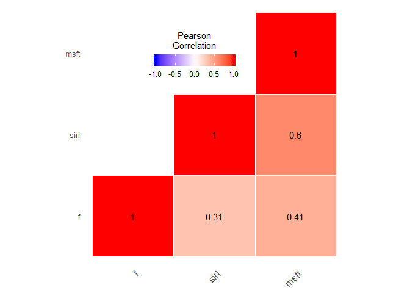

```r
library(tidyverse)
```

```
## -- Attaching packages ------------------------------------------------------ tidyverse 1.2.1 --
```

```
## v ggplot2 3.0.0     v purrr   0.2.5
## v tibble  1.4.2     v dplyr   0.7.6
## v tidyr   0.8.1     v stringr 1.3.1
## v readr   1.1.1     v forcats 0.3.0
```

```
## -- Conflicts --------------------------------------------------------- tidyverse_conflicts() --
## x dplyr::filter() masks stats::filter()
## x dplyr::lag()    masks stats::lag()
```

```r
library(ggplot2)
library(readxl)
library(dplyr)
library(reshape2)
```

```
## 
## Attaching package: 'reshape2'
```

```
## The following object is masked from 'package:tidyr':
## 
##     smiths
```

```r
#http://www.sthda.com/english/wiki/correlation-test-between-two-variables-in-r
#http://www.sthda.com/english/wiki/ggplot2-quick-correlation-matrix-heatmap-r-software-and-data-visualization
#dat <- read_excel("C:/Users/Saffra/Documents/T3/compiled_data.xlsx")


# Reading in data for each ticker
siri <- read_csv("C:/Users/Saffra/Documents/T3/Data/SIRI.csv")
```

```
## Parsed with column specification:
## cols(
##   Date = col_date(format = ""),
##   Open = col_double(),
##   High = col_double(),
##   Low = col_double(),
##   Close = col_double(),
##   `Adj Close` = col_double(),
##   Volume = col_double()
## )
```

```r
msft <- read_csv("C:/Users/Saffra/Documents/T3/Data/MSFT.csv")
```

```
## Parsed with column specification:
## cols(
##   Date = col_date(format = ""),
##   Open = col_double(),
##   High = col_double(),
##   Low = col_double(),
##   Close = col_double(),
##   `Adj Close` = col_double(),
##   Volume = col_double()
## )
```

```r
f <- read_csv("C:/Users/Saffra/Documents/T3/Data/F.csv") 
```

```
## Parsed with column specification:
## cols(
##   Date = col_date(format = ""),
##   Open = col_double(),
##   High = col_double(),
##   Low = col_double(),
##   Close = col_double(),
##   `Adj Close` = col_double(),
##   Volume = col_double()
## )
```

```r
# Clean out all of the columns except for date and adjusted close. 

siri$Open <- NULL
siri$High <- NULL
siri$Low <- NULL
siri$Close <- NULL
siri$Volume <- NULL

msft$Open <- NULL
msft$High <- NULL
msft$Low <- NULL
msft$Close <- NULL
msft$Volume <- NULL

f$Open <- NULL
f$High <- NULL
f$Low <- NULL
f$Close <- NULL
f$Volume <- NULL


# Renaming adjusted close column to ticker
colnames(siri)[colnames(siri) == 'Adj Close'] <- 'siri'
colnames(msft)[colnames(msft) == 'Adj Close'] <- 'msft'
colnames(f)[colnames(f) == 'Adj Close'] <- 'f'


# Joining the data into one dataset 
combined_dat <- f %>% 
  left_join(siri) %>% 
  left_join(msft)
```

```
## Joining, by = "Date"
```

```
## Joining, by = "Date"
```

```r
# Computing the correlation matrix (and deleting the date column for now)
combined_dat$Date <- NULL
cormat <- round(cor(combined_dat),2)


# "melting" the data for the heat map
melted_cormat <- melt(cormat)


# Creating the rough map
# ggplot(data = melted_cormat, aes(x=Var1, y=Var2, fill=value)) + 
#   geom_tile()

# Get lower triangle of the correlation matrix
get_lower_tri<-function(cormat){
  cormat[upper.tri(cormat)] <- NA
  return(cormat)
}
# Get upper triangle of the correlation matrix
get_upper_tri <- function(cormat){
  cormat[lower.tri(cormat)]<- NA
  return(cormat)
}

upper_tri <- get_upper_tri(cormat)
upper_tri
```

```
##       f siri msft
## f     1 0.31 0.41
## siri NA 1.00 0.60
## msft NA   NA 1.00
```

```r
# Melt the correlation matrix
melted_cormat <- melt(upper_tri, na.rm = TRUE)


# Heatmap
# ggplot(data = melted_cormat, aes(Var2, Var1, fill = value))+
#   geom_tile(color = "white")+
#   scale_fill_gradient2(low = "blue", high = "red", mid = "white", 
#                        midpoint = 0, limit = c(-1,1), space = "Lab", 
#                        name="Pearson\nCorrelation") +
#   theme_minimal()+ 
#   theme(axis.text.x = element_text(angle = 45, vjust = 1, 
#                                    size = 12, hjust = 1))+
#   coord_fixed()


# Helper function to reorder the correlation matrix 
reorder_cormat <- function(cormat){
  # Use correlation between variables as distance
  dd <- as.dist((1-cormat)/2)
  hc <- hclust(dd)
  cormat <-cormat[hc$order, hc$order]
}


# Reordered correlation data visualization
# Reorder the correlation matrix
cormat <- reorder_cormat(cormat)
upper_tri <- get_upper_tri(cormat)
# Melt the correlation matrix
melted_cormat <- melt(upper_tri, na.rm = TRUE)
# Create a ggheatmap
ggheatmap <- ggplot(melted_cormat, aes(Var2, Var1, fill = value))+
  geom_tile(color = "white")+
  scale_fill_gradient2(low = "blue", high = "red", mid = "white", 
                       midpoint = 0, limit = c(-1,1), space = "Lab", 
                       name="Pearson\nCorrelation") +
  theme_minimal()+ # minimal theme
  theme(axis.text.x = element_text(angle = 45, vjust = 1, 
                                   size = 12, hjust = 1))+
  coord_fixed()
# Print the heatmap
#print(ggheatmap)


# Add correlation coefficients on the heatmap
ggheatmap + 
  geom_text(aes(Var2, Var1, label = value), color = "black", size = 4) +
  theme(
    axis.title.x = element_blank(),
    axis.title.y = element_blank(),
    panel.grid.major = element_blank(),
    panel.border = element_blank(),
    panel.background = element_blank(),
    axis.ticks = element_blank(),
    legend.justification = c(1, 0),
    legend.position = c(0.6, 0.7),
    legend.direction = "horizontal")+
  guides(fill = guide_colorbar(barwidth = 7, barheight = 1,
                               title.position = "top", title.hjust = 0.5))
```

<!-- -->

